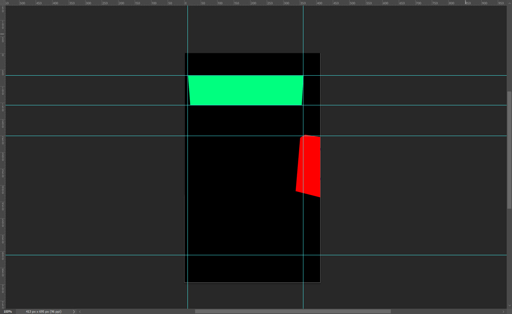

# delphi_fmx_3d
Contains a sample app that calculates the screen coordinates from 3D objects in a Form3D and a TLayer3D

## Validating Results

Here we have a screen shot of the Form3D without the title bar and the respective  coordinates shown in the console.

