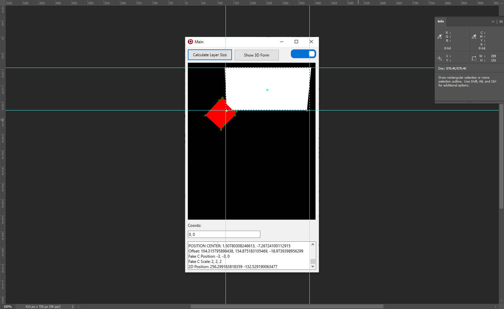

# delphi_fmx_3d
Contains a sample app that calculates the screen coordinates from 3D objects in a Form3D and a TLayer3D

## Validating Results

Here is the running application

The respective coordinates for the green TLayer3D, top left and bottom right

